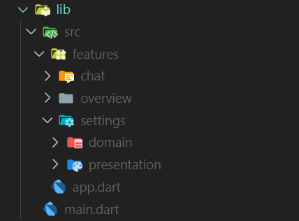

# Simple Project Structure

## Feature First

- Pro Feature ein Ordner 
- jedes Feature besteht aus:
    - `domain`-Ordner
        - hier liegen die Model-Klasse
    - `presentation`-Ordner
        - hier liegen die Widgets
